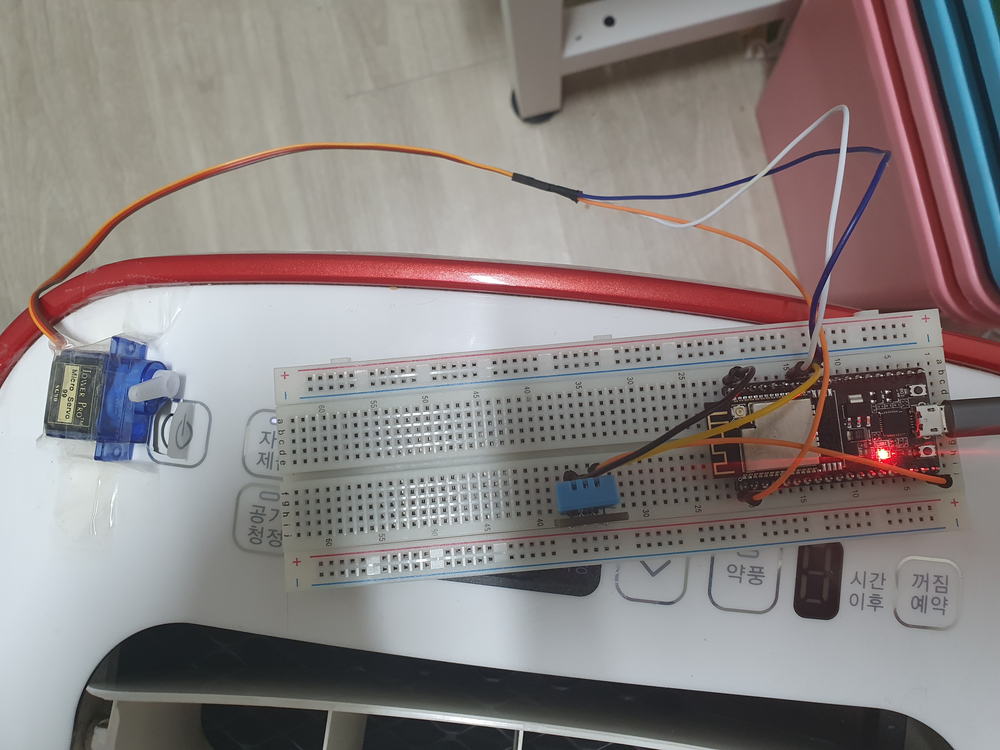
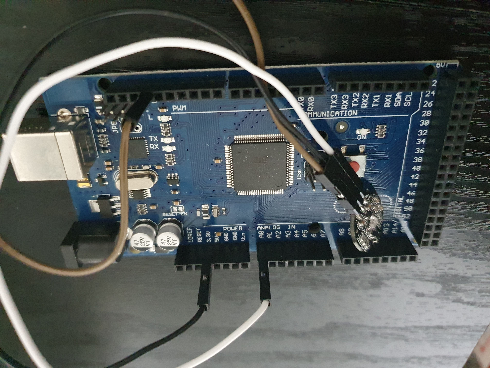

# 사물인터넷 기초 프로젝트
## 개발환경
### 필요 디바이스, 센서, 모듈 및 기타 개발 환경
습도 센서 모듈(DHT11), 심박 측정 센서(Pulse/Heart Rate Sensor [SZH-SSBH-035]), ESP32, 브레드보드, 서보모터, 선풍기모터(스탭모터), 아두이노 메가 2560 보드 및 기타 케이블과 테이프 정도가 필요하다.
### 회로 사진

### 실습에서 도출된 결과 기재 및 분석
온습도

BPM

서보모터

- 웹 속도가 느려져 다운되는 현상이 발생했다.
- 서보센서가 단단히 고정되지 않아 버튼을 누르는 것이 어려웠다.
- 습도 센서 모듈과 심박 측정 센서의 측정값이 생각보다 정확하지 않아 수면에 든 시기를 판단하기가 어려웠다.
- 심박수만으로는 정확한 수면 시간을 파악하기 어려웠다. 특히 사전 심박측정센서 테스트 과정에서 기상 직전과 직후를 판단하는 것이 어려워 버튼으로 대체하였다. 수면 중 심박도의 양상은 나이, 수면무호흡증, 부정맥 등 기저질환과 같은 개인 건강 상태와 스트레스, 음주 등 여러 요인에 의해 변할 수 있기 때문이다. 움직임센서나 심박변이도를 측정할 수 있는 로직 등이 마련된다면 더 정확한 측정이 가능할 것으로 보인다.